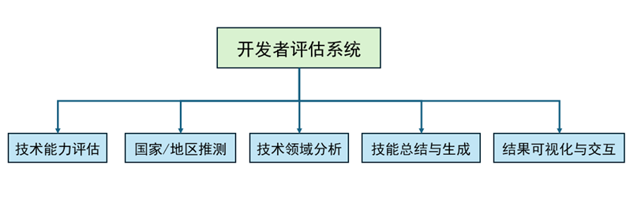
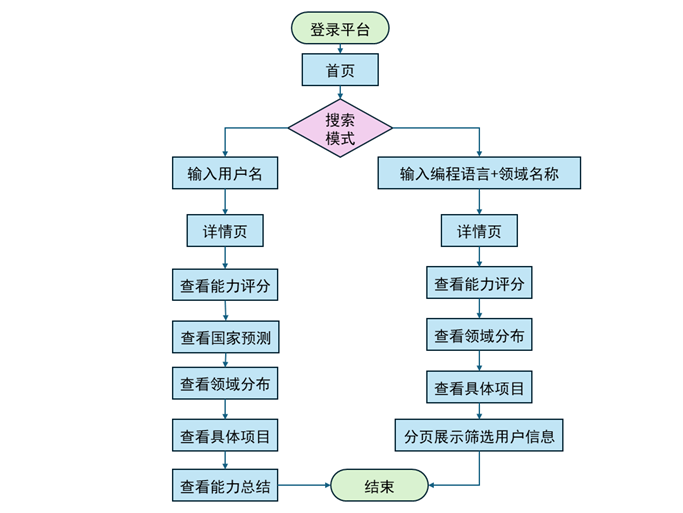
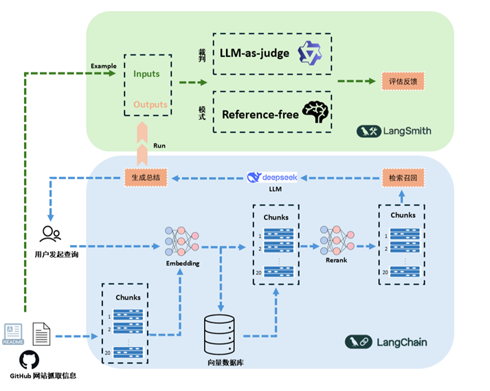
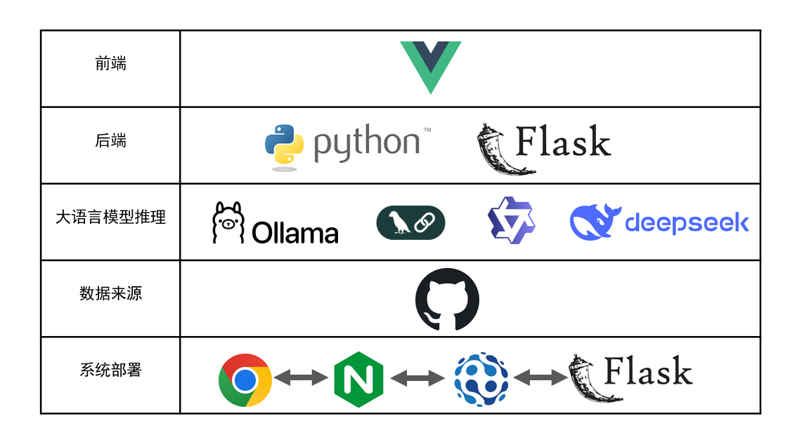

# 开发者评估系统

## 📖 项目描述

开发者评估系统是一个用于分析和评估 GitHub 开发者的综合工具。它通过爬取开发者的个人资料、代码仓库和活动数据，来洞察其技术技能、专业领域、贡献模式以及潜在的地理位置。该系统利用 Ollama 运行的本地大语言模型 (LLM) 以及 RAG (检索增强生成) 技术，进行深入的技能分析和总结生成。

项目包含一个 Python 后端 (Flask API)，负责数据收集、分析及与 LLM 的交互；以及一个 Vue.js 前端，提供用户界面来搜索开发者并展示评估结果。

## 🎥 demo
<video controls src="./assets/recording.mp4" title="Title"></video>

## ✨ 主要功能

* **开发者资料爬取**：从 GitHub 个人资料中获取全面的数据，包括 README、代码仓库以及关联的博客。
* **技术能力评估**：综合考量开发者的项目贡献度、项目影响力及协作关系网络，量化开发者综合技术水平提供分级评价。
* **国家预测**：基于个人资料、社交网络分析（关注者/正在关注）以及内容中的语言/文化线索，预测开发者所在的国家。
* **领域分析**：通过分析仓库名称、描述、主题和编程语言，利用层级化领域模型和语义匹配，识别开发者的核心专业领域。
* **技能总结生成**：利用 LLM 和 RAG 技术，根据检索到的信息生成关于开发者技术能力的自然语言总结。
* **交互式前端**：一个 Vue.js 应用，用于搜索开发者并展示详细的分析结果。
* **Langsmith 集成**：支持对基于 LLM 的功能进行实验跟踪和评估。





## 🛠️ 技术栈
### 前端

* **Vue.js 3**
* **Vite**

### 后端 && LLM

* **Python 3.x**
* **Flask**: Web 框架，用于构建 API。
* **Langchain & Langsmith**: 用于开发和监控 LLM 应用的框架。
* **Ollama**: 用于运行本地大语言模型 (例如 `deepseek-r1:7b`, `qwen3:8b`, `nomic-embed-text`)。
* **FAISS**: 用于在向量存储中进行高效的相似度搜索。




## ⚙️ 环境准备

* **Git**
* **Node.js**: (例如: v18+，Vite 项目推荐)
* **Python**: (例如: v3.8 - v3.10，根据库的兼容性选择)
* **Ollama**: 需要预先安装并运行。
    * 在启动应用前，请确保已拉取所需的模型：
        ```bash
        ollama pull deepseek-r1:7b
        ollama pull qwen3:8b
        ollama pull nomic-embed-text
        ```
        (具体的模型名称在 `src/config.py` 中定义)
* **GitHub 个人访问令牌 (PAT)**: 用于向 GitHub API 发出认证请求，以避免速率限制。

## 🚀 安装与启动

### 后端

1.  **克隆代码仓库:**
    ```bash
    git clone git@github.com:Xinlu-Y/Developer-Evaluation-System.git
    cd DEVELOPER-EVALUATION-SYSTEM
    ```

2.  **使用 Conda 创建并激活虚拟环境:**
    ```bash
    conda create -n dev python=3.10
    conda activate dev
    ```

3.  **安装 Python 依赖:**
    ```bash
    pip install -r requirements.txt
    ```

4.  **下载 spaCy 语言模型:**
    ```bash
    python -m spacy download en_core_web_sm
    ```

5.  **设置环境变量:**
    * 新建你的 GitHub 个人访问令牌和 Ollama 基础 URL (如果不是默认值)为环境变量:
        ```env
        GITHUB_TOKEN="your_github_personal_access_token"
        OLLAMA_BASE_URL="[http://127.0.0.1:11434](http://127.0.0.1:11434)"
        ```
        (这些变量被 `src/config.py` 使用)

### 前端

1.  **进入前端目录:**
    ```bash
    cd frontend
    ```

2.  **安装 Node.js 依赖:**
    ```bash
    npm install
    ```

## ▶️ 运行应用

请确保您的 Ollama 服务正在运行，并且已经拉取了所需的模型。

### 后端 (Flask API)

1.  确保已激活 Python 虚拟环境。
2.  在**项目根目录** (`DEVELOPER-EVALUATION-SYSTEM`) 下运行:
    ```bash
    python src/main.py
    ```
3.  后端服务将会启动，通常监听于 `http://localhost:5000` 。

### 前端 (Vite 开发服务器)

1.  进入 `frontend` 目录:
    ```bash
    cd frontend
    ```
2.  运行开发服务器:
    ```bash
    npm run dev
    ```

## 🔧 配置信息

* **后端**: 大部分后端配置，包括 API 令牌、LLM 模型名称、提示词设置，都可以在 `src/config.py` 中找到和修改。
* **前端**: 前端主要的 API 端点配置位于 `frontend/src/api/github.js`。

## 🔗 API 端点

后端提供以下主要 API 端点 (定义于 `src/main.py`):

* `GET /api/developer/<username>`: 获取指定开发者的详细信息，包括个人资料、国家预测、仓库分析、领域专长和评分。
* `GET /api/developer/skills/<username>`: 使用LLM分析并返回开发者的技能总结。可选 `query` 参数。
* `GET /api/search/domain`: 根据编程语言和主题搜索开发者。

## 🤝 贡献指南
## 📄 开源许可
